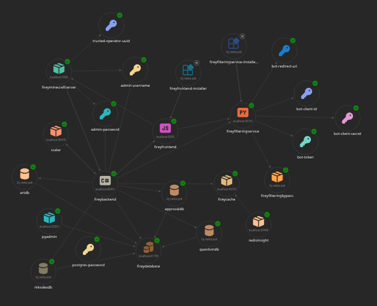

# The Thefirey33 Network

This is the website for Thefirey33's Portfolio purposes. It hosts a Svelte front-end with a C# ASP.NET Core backend.

## Architecture

- ASP.NET Core with JWT Bearer Authentication (Backend)
- SvelteKit with Vite and Cookie Based Authentication (Front-End)

The backend uses a one-use AuthToken system that when a login to the Admin page is requested, the specified token will be printed to the log.
For extremely secure access. This allows the password guessing style system to not happen.

## Configuration

To configure this project, there's 2 locations that you need to configure.
Firstly, located in `/thefirey33.net`:

```json
{
  "Logging": {
    "LogLevel": {
      "Default": "Information",
      "Microsoft.AspNetCore": "Warning"
    }
  },
  "Parameters:admin-username": "<admin name goes here>", // This is the Admin Username.
  "Parameters:admin-password": "<admin password goes here>", // This is the Admin Password.
  "Parameters:trusted-operator-uuid": "<trusted minecraft user goes here>" // This is to set the operator of the Minecraft Server.
}
```

This is for the general configuration, that affects the other projects, which are the backend and the Minecraft server. As they both need their parameters to function correctly.

And the second one located in `/thefirey33-backend`:

```json
{
  "Logging": {
    "LogLevel": {
      "Default": "Information",
      "Microsoft.AspNetCore": "Warning"
    }
  },
  "Jwt": {
    "Issuer": "<issuer goes here>", // The issuer of the JWT Token.
    "Audience": "<audience goes here>", // The audience of the JWT Token.
    "Key": "<JWT key goes here>" // The JWT Secret Key itself. You can run "openssl rand -hex 32" to get a key, for example.s
  }
}
```

This is for the authentication/authorization system, which is to access the admin panel. Where the user can modify the Approved state of Minecraft Players and the current uploaded arts on the website.

## Dependencies

- .NET 10.0 (SDK)
- Aspire *(This is the stack manager used for the project.)*
- ASP.NET Core
- Node.js and NPM *(The project strictly uses NPM as it's package manager currently.)*
- Docker and Docker Compose *(This is for the deployment and Minecraft Server running phase.)*
- Dotnet EF (Database Migration Tool. install with `dotnet tool install --global dotnet-ef`)

## Stack



## License

This project uses the MIT License for all sections that aren't created by Thefirey33.